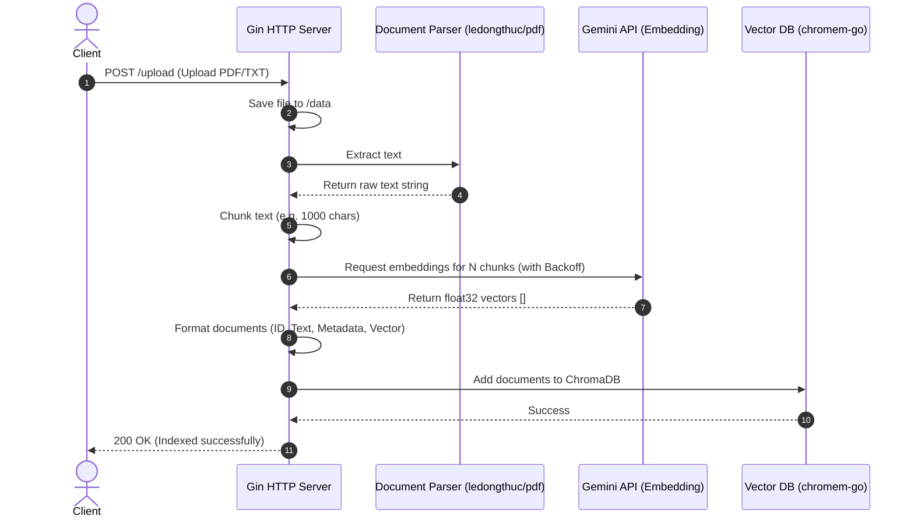
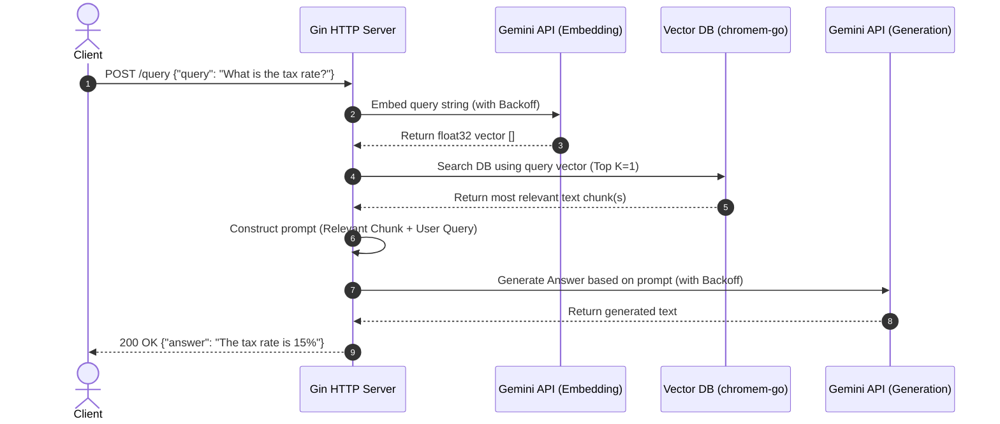

# RAG Architecture Flow

This diagram illustrates the two primary flows in the Retrieval-Augmented Generation (RAG) system: **Indexing** (Uploading a document) and **Querying** (Asking a question). 

GitHub natively renders `mermaid.js` diagrams.

## 1. Document Indexing Flow (`/upload`)
The flow of taking a raw PDF/TXT and converting it into searchable vector embeddings.

## 2. Query Generation Flow (`/query`)
The flow of asking a question, finding relevant context, and generating an LLM response.

